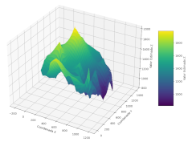

# GCK Suite: Geostatistical Kriging with Generalized Covariance (C)



The **GCK (Generalized Covariance Kriging) Suite** is a collection of C programs designed to perform Universal Kriging (UK) based on the theory of Generalized Covariance (GC) functions and the Generalized Increment of order k (GIK) approach.

This suite manages the entire geostatistical workflow:
1. **GIK Calculation** (`gik2`)
2. **Model Fitting** (`geko`)
3. **Model Validation** (`crosval2`)
4. **Final Interpolation** (`faik2`)

The final result of the process is written to the files `faik.grd` (estimate) and `faike.grd` (standard error or square root of variance), both in ASCII format from `SURFER` (Golden Software, Inc.). This is a simple format: it has a header that defines the size and coordinates of the grid, followed by the grid values ​​by rows; 1.70141e+38 is the discard or `NaN` value. 

Two versions of the programs are maintained here:

1. As standalone programs, for historical reasons, in the `progs/` subdirectory.
2. As programs with common functions in a shared library (`libGCK2.c`) in the `libGCK/` subdirectory.

In fact, the main goal of this project was the creation of the `libGCK.c` library, which was used in a `Python3` project where data management and plotting were handled by `pandas`, `numpy`, `matplotlib`, etc., while the calculations were entrusted to the C library. For this reason, no attempt was made to modernize the user interface, leaving it as it was in the past (see historical note below). However, the aforementioned project was abandoned in favor of a pure Python 3 project that will be released under the name: `pyGEKO`.

## 🛠️ Compilation

This suite has been only tested with `GCC version 12.2.0 (Debian 12.2.0-14+deb12u1)`, but it can probably be built on almost any architecture/compiler (see historical note below).

### Directory `progs/`

```bash
# Example compilation if `gcc` is your `C` compiler
gcc -o gik2 gik2.c  -lm
gcc -o geko geko.c  -lm
gcc -o crosval2 crosval2.c  -lm
gcc -o faik2 faik2.c  -lm

```

or simply use the `Makefile` that will place all executables in the `bin/` subdirectory:

```bash

$ make

```

### Directory `libGCK/`

The four programs (`gik2.c`, `geko.c`, `crosval2.c`, `faik2.c`) depend on shared geostatistical and mathematical routines (within the library `libGCK2.c`).

To compile the executables, ensure all source files are available and link against the math library (`-lm`):

```bash
# Example compilation command (assuming all routines are in their respective files)
gcc -o gik2 gik2.c libGCK2.c -lm
gcc -o geko geko.c libGCK2.c -lm
gcc -o crosval2 crosval2.c libGCK2.c -lm
gcc -o faik2 faik2.c libGCK2.c -lm

```

or use the included `Makefile` that will place all executables in the `bin/` subdirectory:

```bash

$ make

```

## Use

See: [Example Workflow](workflow.md)

## About the library sources `libGCK.c` and `libGCK.c`

1. `libGCK2.c` is the library file used to build the four programs
1. `libGCK.c` is the library file to be wrapped by `Python ctypes`. It has the same content as the previous one plus four `main_*` entry functions that correspond to the four `main()` functions of the four programs; the functions to be wrapped by `ctypes`.

These source files have been generously and extensively commented on and documented by Artificial Intelligence (Google GEMINI).
See:

* [libGCK.md](libGCK/libGCK.md)
* [libGCK2.md](libGCK/libGCK2.md)

## At the dawn of time,  a historical note

This is a somewhat nostalgic project for the author...

In the late 1980s, he developed four Fortran programs for the VAX-11/780, running the VMS operating system, at the University of Seville. A second version of the programs gik.for, crosval.for, and faik.for, featuring nearest neighbor search by octants, soon followed. The purpose of these programs was to perform automatic mapping of certain problems related to the structure of the Milky Way. The technology employed was generalized covariance kriging, which was briefly presented to the astronomical community in [Topography of the Galactic Disk: Z Structure and Large-Scale Star Formation](https://ui.adsabs.harvard.edu/abs/1991ApJ...378..106A/abstract)[1]. Soon, these programs were translated to `VAX-C` on a microVAX-2000/VMS (they all still run on a [microVAX simulator](https://github.com/simh/simh)!) and versions were developed for personal computers (using `Borland TurboC` under `MSDOS`), `VAX-11/VMS`, `VAX-11/Ultrix` and the `CONVEX C2000` series vectorial minisupercomputer under `CONVEXOS`.

The rescued `C` sources used here correspond to those used in `TurboC (MSDOS)` dated November 24, 1994. As of December 10, 2025, after trivial modifications, they were compiled under `GCC version 12.2.0 (Debian 12.2.0-14+deb12u1)` and ran as they used to three decades ago, thus starting this project.

## Subdirectory `vax/`

For the author's archival purposes, the `vax/` directory contains the original sources for VAX11/VMS dating from November 15, 1991.


>[1] Alfaro, E. J., Cabrera-Cano, J., and Delgado, A. J., “Topography of the Galactic Disk: Z-Structure and Large-Scale Star Formation”, <i>The Astrophysical Journal</i>, vol. 378, IOP, p. 106, 1991. doi:10.1086/170410.
